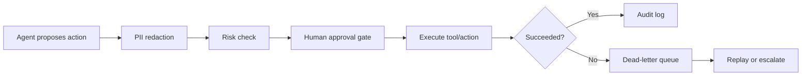

# Deep Dive: agent-utils
> Updated score: 66/100 | Verdict: BEST B2B/INFRA BET IF NARROWED

## What It Does
Agent-utils is an API layer for AI agent infrastructure primitives. The original product included 11 tools such as ephemeral file hosting, PII redaction, dead-letter queues, human-in-the-loop gates, and other utilities behind one API key. Live at agent-utils.com. Open source AGPL-3.0.

## Updated Thesis
The broad "11 utilities for agents" positioning is too fuzzy. It sounds useful, but it does not create a clear buying trigger.

The stronger wedge is:

> A side-effect safety and recovery layer for AI agents.

Focus on 3 primitives:

1. Human approval gates
2. Dead-letter queue / replay
3. PII redaction + audit log

These are connected by one buyer anxiety:

> My agent is about to do something sensitive, broken, expensive, or unrecoverable.

That is a much sharper product than "random agent utilities."

## Competitive Landscape

| Competitor | Pricing | Target | Key Features | Weakness |
|---|---:|---|---|---|
| **Composio** | Free + paid from ~$29/mo | Agent devs | 250+ external tool integrations, auth, managed tool calls | Broad integration platform, not focused on side-effect control |
| **LangSmith** | Free + paid | AI teams | Tracing, evals, prompt observability, deployment runs, HITL concepts | Observability-first, not a small drop-in side-effect API |
| **Toolhouse** | Paid tiers | Agent devs | Hosted tool execution and tool marketplace | Tool/action platform, not safety/replay primitive |
| **E2B** | Paid usage | Agent devs | Sandboxed code execution | Single-purpose execution environment |
| **Temporal** | OSS/cloud | Engineering teams | Durable workflows, retries, orchestration | Powerful but overkill for small agent apps |
| **Trigger.dev** | Free/paid | Developers | Background jobs and durable functions | General-purpose jobs, not agent-native approval/audit |
| **ngrok** | Free/paid | Developers | Tunnels, connectivity, webhooks | Networking only |
| **Custom internal code** | Engineering time | AI startups | Teams build their own approval/retry/audit systems | Rebuilt badly in every agent project |

### Competitive Correction
The old claim that no one offers agent primitives is too broad. Composio, LangSmith, Toolhouse, Temporal, Trigger.dev, and framework-native systems all overlap with pieces of this.

Relevant current datapoints:

- Composio already sells agent tool integrations and usage-based tool-call tiers: https://composio.dev/pricing
- LangSmith already occupies the agent observability/evaluation/tracing space and includes human-in-the-loop concepts: https://www.langchain.com/pricing
- Security research around tool-enabled agents increasingly highlights risks from over-privileged tools, ambient authority, and unsafe side effects: https://arxiv.org/abs/2605.09721

The gap is narrower but still real:

> Most platforms help agents do more. Agent-utils should help agents do dangerous things safely.

## Repositioning

### Old Positioning
API utilities for AI agents.

### Better Positioning
Safety, approval, and replay infrastructure for AI agent side effects.

### One-Line Pitch
Let your agent propose actions, redact sensitive data, wait for human approval, execute safely, and recover failed actions without losing state.

### Category
Agent side-effect control plane.

## The 3 Core Primitives

### 1. Human Approval Gates
Checkpoint before an agent performs a sensitive action.

Examples:

- Send an email to 2,000 users
- Refund a Stripe payment
- Delete database rows
- Merge a pull request
- Post publicly to Reddit/Slack/X
- Change a production config
- Trigger a deployment

Agent API call:

```json
{
  "action": "send_email_campaign",
  "risk": "high",
  "summary": "Send promo email to 2,000 users",
  "payload": {
    "audience": "trial_users",
    "template_id": "promo_june"
  },
  "requested_by": "growth-agent"
}
```

Agent-utils response:

```json
{
  "approval_id": "appr_123",
  "status": "waiting_for_approval",
  "approval_url": "https://agent-utils.com/approve/appr_123"
}
```

Human can:

- Approve
- Reject
- Edit and approve
- Request changes
- Expire the request

Value:

- Agents can operate autonomously up to a risk boundary.
- Humans stay in control of irreversible or high-impact actions.
- Teams get a record of who approved what and why.

### 2. Dead-Letter Queue / Replay
Stores failed agent actions so they can be inspected, retried, edited, or escalated.

Examples of failures:

- GitHub API rate limit
- Linear timeout
- Stripe customer not found
- Webhook endpoint down
- LLM returned malformed payload
- Tool call succeeded partially

Stored dead-letter item:

```json
{
  "task_id": "task_123",
  "action": "update_linear_ticket",
  "status": "failed",
  "error": "429 rate limit",
  "payload": {
    "issue_id": "LIN-42",
    "status": "Done"
  },
  "retry_count": 2,
  "next_retry_at": "2026-06-08T14:00:00Z",
  "agent_id": "coding-agent"
}
```

Dashboard actions:

- Retry now
- Edit payload and replay
- Mark resolved
- Escalate to human
- Attach note
- View execution history

Value:

- Failed agent actions do not disappear.
- Teams can recover half-complete workflows.
- Agents become debuggable and operationally sane.

### 3. PII Redaction + Audit Log
Detects and redacts sensitive data before it reaches LLMs, logs, third-party tools, or public channels.

Example input:

```text
Customer Jane Tan, NRIC S1234567A, email jane@example.com, card ending 4242 wants a refund.
```

Redacted output:

```text
Customer [PERSON], NRIC [SINGAPORE_NRIC], email [EMAIL], card ending [CARD_LAST4] wants a refund.
```

Audit log:

```json
{
  "agent_id": "support-agent",
  "action": "refund_analysis",
  "pii_detected": ["PERSON", "SINGAPORE_NRIC", "EMAIL", "CARD_LAST4"],
  "redacted": true,
  "destination": "llm_prompt",
  "timestamp": "2026-06-08T13:10:00Z"
}
```

Value:

- Reduces accidental leakage into model prompts, tool calls, logs, Slack messages, and traces.
- Creates evidence for audits and internal reviews.
- Gives teams confidence to use agents with real customer data.

## Why These 3 Fit Together
They cover the lifecycle of an agent side effect:



This creates a coherent product:

> Agents can act, but sensitive actions are approved, private data is controlled, and failed actions are recoverable.

## Target Customers

### Primary
AI startups and internal AI teams building agents that touch real systems:

- Customer support agents
- Sales/revops agents
- Coding agents
- Finance/admin agents
- Data ops agents
- Workflow automation agents

### Secondary

- Agencies building agent workflows for clients
- Indie hackers deploying agents into production
- Teams experimenting with Claude Code/Codex-style automations
- Compliance-sensitive teams that want lightweight controls before adopting agents

## Core User Pain

- "My agent can call tools, but I do not trust it with irreversible actions."
- "When a tool call fails, I have no idea what happened."
- "We need a human to approve refunds/emails/deploys."
- "I do not want customer PII leaking into LLM prompts or logs."
- "Every agent app rebuilds approval, retries, and audit trails from scratch."

## Product Features

### Must Build Next
1. **Approval gate API**
   - Create approval request
   - Approve/reject/edit
   - Expiry
   - Risk levels
   - Webhook callback when approved/rejected

2. **Approval dashboard**
   - Pending approvals
   - Approver identity
   - Diff/payload view
   - Approval history

3. **Dead-letter queue**
   - Store failed action
   - Retry policies
   - Manual replay
   - Edit and replay
   - Escalation status

4. **PII redaction API**
   - Redact text
   - Redact JSON payloads
   - Configurable detectors
   - Region-specific detectors, especially SG NRIC/phone/address patterns

5. **Audit log**
   - Immutable event stream
   - Search/filter by agent/action/user
   - Export CSV/JSON
   - Retention controls

6. **API key management**
   - Project keys
   - Key rotation
   - Per-environment keys
   - Scoped permissions

### Should Build After Revenue
1. **SDKs**
   - TypeScript
   - Python

2. **Framework adapters**
   - LangChain
   - CrewAI
   - AutoGen
   - OpenAI Agents SDK
   - Claude/Codex workflow examples

3. **Policy engine**
   - "Require approval if amount > $100"
   - "Require approval before sending external email"
   - "Auto-reject if PII appears in public destination"

4. **Slack/Email approvals**
   - Approve from Slack
   - Approve from email
   - Mobile-friendly approval pages

### Deprioritize / Remove From Core Story
- Generic ephemeral file hosting
- Miscellaneous helper APIs
- Agent-to-agent communication
- Vector storage
- General observability/tracing
- Full workflow orchestration
- General tool marketplace

Those make the product feel scattered and pull it into fights with Composio, LangSmith, Temporal, and Trigger.dev.

## Pricing

| Tier | Price | Limits | Target |
|---|---:|---|---|
| Free | $0 | 1 project, 1k events/mo, 100 approvals/mo | Evaluation |
| Pro | $29/mo | 25k events/mo, 1k approvals/mo, 7-day audit retention | Indie agent devs |
| Team | $99/mo | 250k events/mo, 10k approvals/mo, 30-day retention, Slack approvals | AI startups |
| Business | $299/mo | 1M events/mo, 90-day retention, policy engine, priority support | Production agent teams |
| Enterprise | Custom | SSO, custom retention, compliance review, on-prem/VPC option | Larger/security-sensitive teams |

Price by events/approvals, not seats. This maps to production usage and avoids seat-count friction.

## Go-To-Market

### Developer Hooks

- "Add human approval to your AI agent in 5 minutes"
- "Dead-letter queue for failed LLM tool calls"
- "PII redaction before your agent calls OpenAI"
- "Audit logs for agent actions"
- "Make Claude/Codex agents safe around production systems"

### Launch Channels

- Hacker News
- r/LocalLLaMA
- r/LangChain
- AI engineering Twitter/X
- LangChain/CrewAI/AutoGen communities
- Open-source agent framework examples

### Demo Ideas

1. **Refund agent**
   - Agent proposes refund
   - PII redacted
   - Human approves
   - Stripe call simulated
   - Audit log generated

2. **Coding agent**
   - Agent proposes PR merge
   - Approval required
   - GitHub API fails
   - Action enters dead-letter queue
   - User replays after fixing token

3. **Support agent**
   - User message contains PII
   - PII redacted before LLM
   - Agent drafts response
   - Human approves external send

## Revenue Path

At $99 ARPU:

- 50 customers = $4.95K MRR
- 100 customers = $9.9K MRR
- 200 customers = $19.8K MRR

This is more realistic than chasing hundreds of hobbyists at $29/mo. The value shows up when agents touch customer data, money, production systems, or public channels.

## Risks

1. **Market too early**
   - Many agent projects are prototypes.
   - Mitigation: open-source examples and framework adapters, target teams already shipping agents.

2. **Category confusion**
   - "Agent utilities" sounds vague.
   - Mitigation: lead with approval/replay/redaction, not the full toolbox.

3. **Security liability**
   - PII handling and audit logs create trust expectations.
   - Mitigation: minimal retention, encryption, explicit data-processing docs, no unnecessary storage.

4. **Incumbent absorption**
   - LangSmith, Composio, Trigger.dev, and agent frameworks may add overlapping features.
   - Mitigation: stay lightweight, framework-neutral, and side-effect focused.

5. **Reliability burden**
   - If approval/replay is in the critical path, downtime matters.
   - Mitigation: transparent status page, retries, exportable logs, clear SLAs for paid tiers.

## Kill Switches

- <100 free signups in first 60 days after focused repositioning
- <5 teams using approvals or DLQ in a real workflow after 90 days
- <5% free-to-paid conversion after 90 days
- >50% monthly churn on paid tier
- Any PII/data incident
- Users mainly use miscellaneous utilities but not approval/replay/redaction

## Recommendation
Build, but narrow hard.

Agent-utils is a good B2B/infra bet only if it stops presenting itself as a bag of helper tools. The durable product is a side-effect safety layer for agents: approval gates, dead-letter replay, PII redaction, and auditability.

This is the right place to be opinionated. Most agent platforms help agents connect to more tools. Agent-utils should help teams trust agents with real workflows.

## Priority Actions

1. Reposition homepage around "agent side-effect safety" instead of "11 utilities."
2. Make approval gates the primary demo.
3. Add dead-letter queue replay UI.
4. Add PII redaction + audit log as a connected workflow.
5. Publish TypeScript and Python examples.
6. Build one polished demo: support/refund/coding agent with approval, redaction, failure, replay, and audit log.
